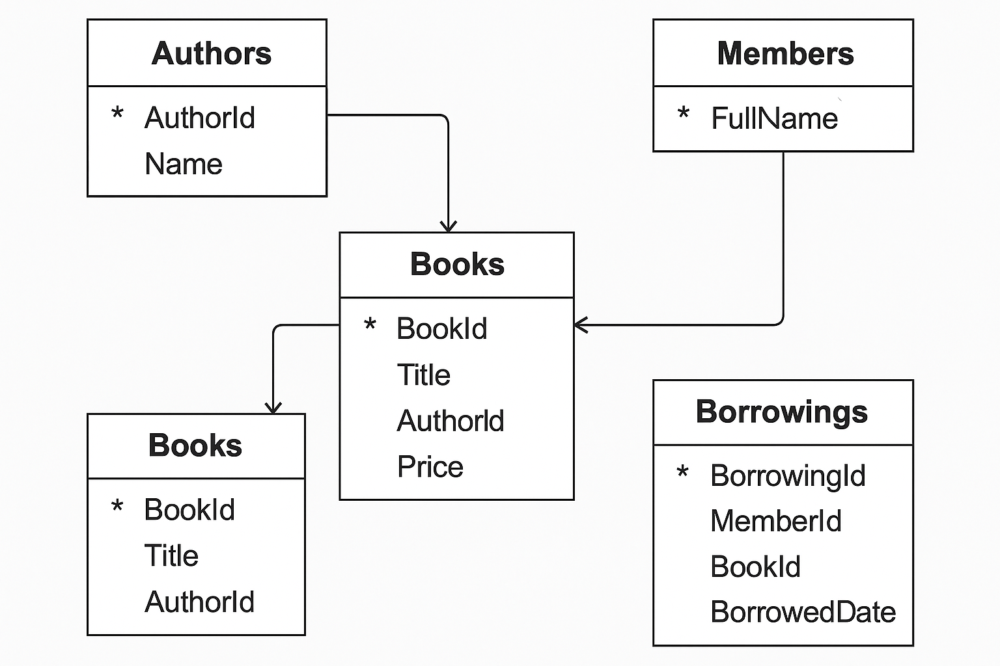

## Practice Entity Framework Core Queries
This project demonstrates various Entity Framework Core queries using a simple library management system. 
It includes examples of basic CRUD operations, filtering, sorting, and eager loading of related data.
I asked Chat GPT to give me some queries to practice with and then I tried to implement them in this console application
then I compare the results with the expected results from ChatGPT.

## Database Schema

### Prerequisites
- .NET 8.0 SDK or later
- Entity Framework Core 8.0 or later
- A SQL Server instance (local or remote)
- Visual Studio or any C# IDE

### Queries Implemented
- [Find the top 3 members who have borrowed the highest number of distinct books in the year 2024.](https://github.com/Anish407/PracticeEfCoreQueries/blob/e79214bfa749cf5478bfc4591ad8e13928f94fe9/LearnEfCore.ConsoleApp/EfCoreQueries/EfCoreQuery.cs#L33)
- [Find the top 3 members who have borrowed the highest number of distinct books in the year 2024.](https://github.com/Anish407/PracticeEfCoreQueries/blob/e79214bfa749cf5478bfc4591ad8e13928f94fe9/LearnEfCore.ConsoleApp/EfCoreQueries/EfCoreQuery.cs#L57)
- [Find the authors whose books have been borrowed by at least 3 different members in 2024.](https://github.com/Anish407/PracticeEfCoreQueries/blob/e79214bfa749cf5478bfc4591ad8e13928f94fe9/LearnEfCore.ConsoleApp/EfCoreQueries/EfCoreQuery.cs#L90)
- [List all members who borrowed the same book more than once (at any time).](https://github.com/Anish407/PracticeEfCoreQueries/blob/e79214bfa749cf5478bfc4591ad8e13928f94fe9/LearnEfCore.ConsoleApp/EfCoreQueries/EfCoreQuery.cs#L123)
- [List all members who borrowed the same book more than once (at any time).](https://github.com/Anish407/PracticeEfCoreQueries/blob/e79214bfa749cf5478bfc4591ad8e13928f94fe9/LearnEfCore.ConsoleApp/EfCoreQueries/EfCoreQuery.cs#L123)
